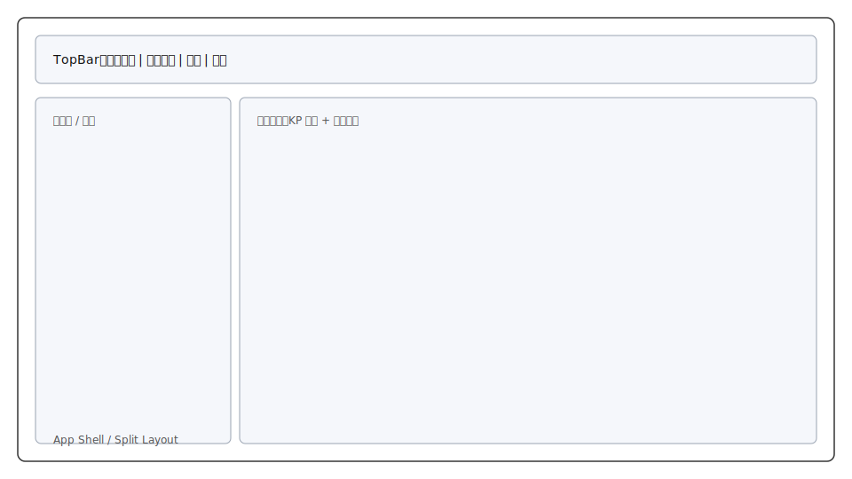
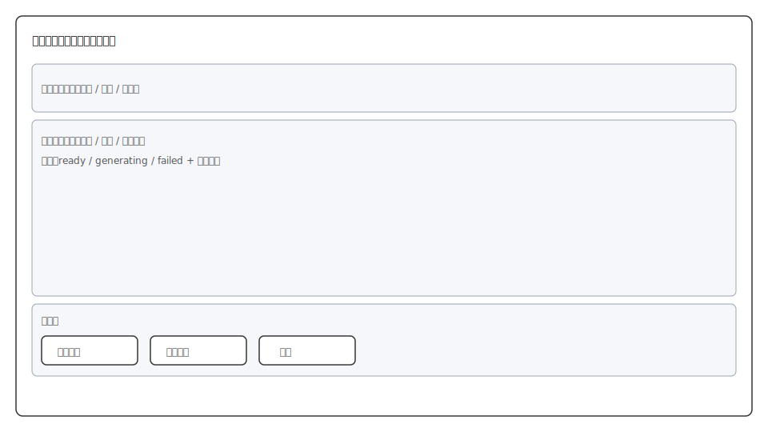
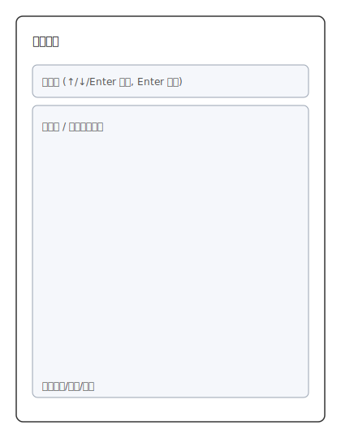
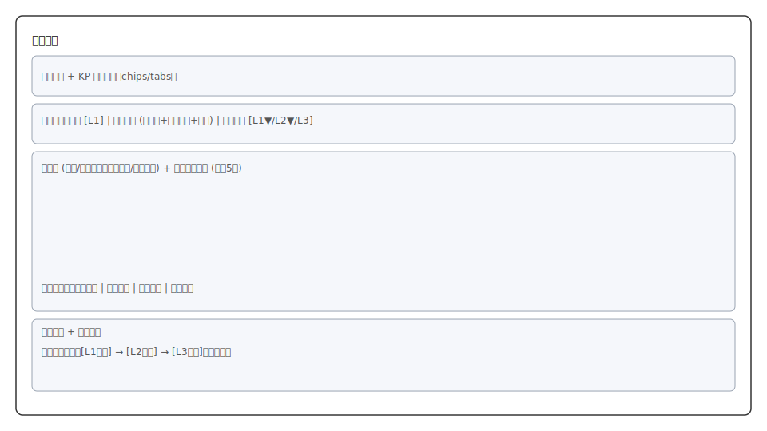
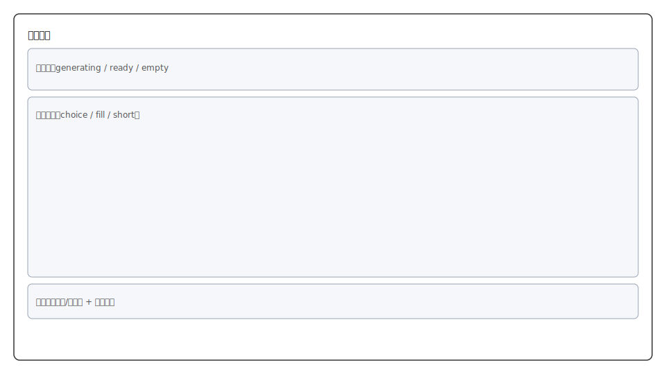
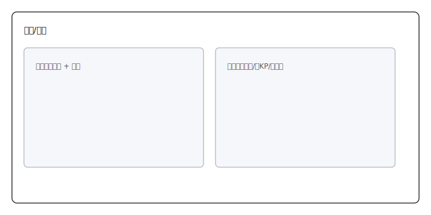

# UI 模块划分（Vue3 + TypeScript）（MVP）

> 目标：把「选书/扫描/章节浏览/知识点学习/习题反馈」拆成 Vue3 常见的 **View（路由页）+ 业务模块组件 + 通用组件**。
>
> 说明：本文是 UI 结构与组件划分建议，不包含具体样式库（ElementPlus/NaiveUI 等）绑定；后续可在不改变模块边界的前提下替换 UI 库。

## 1. 信息架构（IA）总览

本 UI 为**单体 SPA 架构**：所有核心功能在同一前端应用内完成，通过路由/抽屉/面板切换视图，不依赖多站点或多前端应用拆分。

MVP 主界面为单页工作台（Workbench）：

- 顶部栏：书籍选择、当前路径、重新扫描、全局搜索
- 左侧：章节树（支持搜索过滤、键盘导航）
- 右侧：学习面板（知识点横向列表 + 内容区 + 习题入口）
- 书籍设置页：后台任务状态（扫描/总结/习题生成）与刷新/重试

配套的全局状态：

- 启动/扫描中 loading
- 扫描失败/生成失败错误态
- 空数据态（无章节/无知识点/无习题）

## 2. 大模块划分（MVP）

> 这里的“模块”是前端领域模块（domain module），不是 Vue 单文件组件的“模块”。

### 模块 A：App Shell（布局与路由骨架）

**职责**
- 提供全局布局（TopBar + SplitLayout）
- 承载路由（Workbench、BookSettings、Exercises 等）
- 统一处理全局 Loading/Error/Toast

**典型路由 Views**
- `WorkbenchView`：主工作台（章节 + 学习）
- `BookSettingsView`：书籍设置（后台任务状态与刷新）
- `ExercisesView`：习题练习（也可作为 Workbench 内抽屉/弹窗形态，见模块 E）

**子组件（建议）**
- `AppLayout`：整体布局容器
- `TopBar`：顶部栏容器
- `SplitPane`：左右分栏容器（可选第三方实现）

**跨模块通用组件（建议）**
- `AppLoadingOverlay`
- `AppErrorBanner`
- `EmptyState`
- `ConfirmDialog`

**线框图**

**说明**：展示单体 SPA 的整体布局骨架（TopBar + 左右分栏 + 主内容区）。

---

### 模块 B：Book Context（书籍选择 / 扫描 / 任务状态）

**职责**
- 展示/切换 BookRoot，下拉选择
- 触发扫描、展示扫描中/失败/成功状态
- 切换书籍时清空 UI 状态并进入 loading
- 书籍设置页集中展示后台任务状态：扫描 / 总结 / 习题生成
- 支持在设置页执行刷新/重试操作

**关键交互（来自设计文档）**
- 单 BookRoot：自动激活并扫描
- 多 BookRoot：默认上次激活项，可切换
- 点击“重新扫描”：触发重建知识体系
- 扫描失败：错误提示 + 重试

**子组件（建议）**
- `BookRootSelect`
- `ScanButton`
- `ScanStatusChip`（started/in-progress/failed/success）
- `ScanErrorPanel`（失败详情 + 重试）
- `BackgroundTasksPanel`（扫描/总结/习题生成状态）
- `TaskRefreshActions`（刷新/重试）

**组合式函数 / store（建议）**
- `useBookRoots()`：加载 `/books/roots`、激活 `/books/activate`
- `useScanTask()`：触发 `/books/scan`、轮询（若后端提供 taskId 查询；未提供则用“粗粒度 loading”）
- `useAppContextStore()`：当前 bookRootId、scanStatus、lastError

**线框图**

**说明**：书籍切换与扫描状态在顶部/设置区可见，提供重扫与失败重试。

**书籍设置页线框图**

**说明**：后台任务状态集中展示与刷新/重试入口（重新扫描、刷新状态、失败重试）。

---

### 模块 C：Navigation（章节树 / 章节搜索 / 键盘导航）

**职责**
- 获取并展示章节树
- 支持搜索过滤（实时）与键盘导航（↑/↓/Enter）
- 选中章节后驱动右侧学习面板刷新 KP 列表

**子组件（建议）**
- `ChapterTree`
- `ChapterTreeNode`
- `ChapterSearchBox`
- `ChapterSearchResults`（可选：搜索模式下替换树）

**组合式函数 / store（建议）**
- `useChapters()`：`GET /chapters`，缓存树
- `useChapterSearch()`：`GET /chapters/search?q=`
- `useNavigationStore()`：selectedChapterId、expandedNodeIds、searchQuery

**线框图**

**说明**：章节树 + 搜索框的导航区，支持高亮与键盘导航。

---

### 模块 D：Learning（知识点列表 / 学习内容 / 原文对照 / 层次展开 / 关联拓展）

**职责**
- 展示章节下的 KP 横向列表
- 选中 KP 后拉取并呈现：精要速览、原文对照、层次展开
- 展示“当前路径”（章节 > KP > …）
- 可选：关联知识点跳转

**建议的页面结构**
- `KnowledgePointTabs`（横向 KP chips/tabs）
- `LearningPanel`（内容区）
- 内容区以 Tab 或 Segmented 控制：Overview / Source / Levels

**子组件（建议）**
- `KnowledgePointTabs`
- `KnowledgePointChip`
- `LearningContent`
- `OverviewCard`（定义/要点/误区）
- `SourceComparePanel`（片段列表，含 filePath / headingPath / lineStart-lineEnd）
  - 原文片段展示格式：`文件名 | 章节路径 | 行号范围 | 片段内容`
  - 支持复制片段内容、点击跳转定位（打开源文件并定位）
- `SnippetCard`（可复制、可跳转定位）
- `LevelContentPanel`（brief/detailed/deep 切换）
- `RelatedKnowledgePoints`（最多 5 个）

**组合式函数 / store（建议）**
- `useKnowledgePointsByChapter()`：`GET /chapters/knowledge-points?chapterId=`
- `useLearningPack()`：
  - overview：`GET /knowledge-points/overview?kpId=`
  - source：`GET /knowledge-points/source-content?kpId=`
  - levels：`GET /knowledge-points/detailed-content?kpId=&level=`
- `useLearningStore()`：selectedKpId、activeLearningTab（overview/source/levels）、activeLevel

**线框图**

**说明**：知识点横向列表与内容区（概览/原文/层次）布局。

---

### 模块 E：Exercises（习题入口 / 作答 / 反馈）

**职责**
- KP 展开后检查习题状态：ready / generating / not-ready
- 展示题目列表（1~3 题）
- 支持单题提交与批量提交反馈
- 反馈需可解释：讲解 + 参考答案（并支持回到原文证据）

**呈现形态（MVP 建议二选一）**
- 方案 1：独立路由页 `ExercisesView`（简单、结构清晰）
- 方案 2：Workbench 内右侧抽屉/弹窗（更沉浸）

**子组件（建议）**
- `ExercisesEntryButton`
- `ExercisesStatusInline`（generating/ready 提示）
- `ExerciseList`
- `ExerciseCard`
- `AnswerForm`（choice/fill/short 三种渲染）
- `SubmitBar`（提交/批量提交）
- `FeedbackPanel`（correct、explanation、referenceAnswer）

**组合式函数 / store（建议）**
- `useExercises()`：
  - status：`GET /knowledge-points/exercises/status?kpId=`
  - list：`GET /knowledge-points/exercises?kpId=`
  - submit：`POST /exercises/submit`
  - feedback：`POST /exercises/feedback`
- `useExercisesStore()`：answersDraft、feedbackByExerciseId、submitStatus

**线框图**

**说明**：习题状态条、题目列表与提交反馈区布局。

---

### 模块 F：System States（全局状态与异常/空态）

**职责**
- 统一管理：loading、error、empty
- 错误码映射（如 SCAN_FAILED、GENERATION_FAILED、EXERCISE_NOT_READY）
- 统一重试入口（扫描重试、内容重试、习题重试）

**子组件（建议）**
- `ErrorState`（支持“重试”回调）
- `EmptyState`（无章节/无 KP/无习题三种文案）
- `InlineSpinner`（局部 loading）

**线框图**

**说明**：统一错误态与空态组件布局示例。

## 3. 推荐的 Vue3 目录结构（对齐模块边界）

> 这是建议结构，实际可按团队习惯调整。

- `src/views/`
  - `WorkbenchView.vue`
  - `BookSettingsView.vue`
  - `ExercisesView.vue`
- `src/modules/book/`
  - `components/BookRootSelect.vue`
  - `components/ScanButton.vue`
  - `components/BackgroundTasksPanel.vue`
  - `composables/useBookRoots.ts`
  - `stores/book.store.ts`
- `src/modules/navigation/`
  - `components/ChapterTree.vue`
  - `composables/useChapters.ts`
  - `stores/navigation.store.ts`
- `src/modules/learning/`
  - `components/KnowledgePointTabs.vue`
  - `components/OverviewCard.vue`
  - `components/SourceComparePanel.vue`
  - `components/LevelContentPanel.vue`
  - `composables/useLearningPack.ts`
  - `stores/learning.store.ts`
- `src/modules/exercises/`
  - `components/ExerciseCard.vue`
  - `components/FeedbackPanel.vue`
  - `composables/useExercises.ts`
  - `stores/exercises.store.ts`
- `src/shared/`
  - `components/EmptyState.vue`
  - `components/ErrorState.vue`
  - `components/AppLoadingOverlay.vue`
  - `api/http.ts`（axios/fetch 包装、拦截器、错误码映射）
  - `types/`（与后端 DTO 对齐）

## 4. 路由与状态（入口对齐）

- 启动：加载 BookRoots → 自动激活（或用户选择）→ 扫描
- 扫描成功：拉取章节树 → 默认选中第一章（可选）
- 选章节：拉取 KP 列表
- 选 KP：并行拉取 overview/source/levels（或按 Tab 懒加载）
- 进入练习：先 status，再 list；生成中提示并支持刷新

下一步：状态切换图详见 [docs/ui/状态图.md](状态图.md)。
