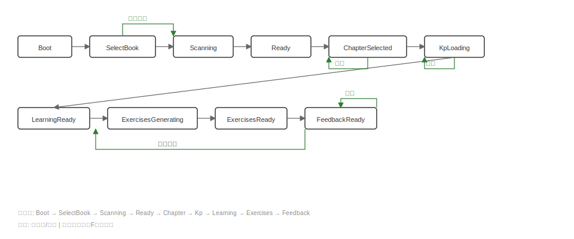

# UI 状态图（页面/模块切换）（MVP）

> 目的：把「启动→选书→扫描→浏览→学习→练习→反馈」的状态与跳转路径可视化，方便实现路由、store 状态机与错误处理。

## 1. 总体状态机（缩略图）

## 2. 关键状态说明

| 状态 | 触发条件 | 退出条件 | 备注 |
|------|---------|---------|------|
| **Boot** | 应用启动 | 加载 `/books/roots` 完成 | 加载书籍根目录配置 |
| **SelectBook** | 多本书时用户需选择 | 用户选择并激活书籍；单书可跳过 | 下拉选择框 |
| **Scanning** | 用户点击扫描或切换书籍 | 扫描完成 | 显示全局 loading |
| **Ready** | 扫描成功 | 用户选择章节 | 章节树可用，可进入 Workbench |
| **ChapterSelected** | 用户点击某章节 | 用户点击另一章节或返回 | 加载该章节 KP 列表 |
| **KpLoading** | 用户点击某 KP | 加载完成 | 加载 overview/source/levels |
| **LearningReady** | 学习内容加载完成 | 用户切换 KP、返回章节、进入习题 | 可切换 Tab 查看概览/原文/层次 |
| **ExercisesGenerating** | 进入习题或点击生成 | 生成完成 | 后台异步生成 |
| **ExercisesReady** | 习题生成完成 | 用户提交答案 | 展示 1~3 道题目 |
| **FeedbackReady** | 用户提交答案 | 用户继续练习或返回学习 | 展示正确性 + 讲解 + 参考答案 |

**失败态（由模块F统一处理）**：ScanFailed、ContentFailed、ExerciseFailed、EmptyChapters、EmptyKPs。错误处理与重试逻辑由模块F统一提供。

## 3. 建议的实现方式（Vue3 习惯）

- 路由层面：
  - `WorkbenchView` 常驻，Exercises 可用路由页或抽屉
- 状态层面：
  - 以 Pinia store 维护 coarse-grained 状态（scanStatus、selectedChapterId、selectedKpId、exercisesStatus）
  - 以 composables 维护请求与缓存（overview/source/levels 可按 Tab 懒加载）
- 错误层面：
  - 统一错误码映射到 UI 行为（例如 `SCAN_IN_PROGRESS` 显示提示并禁用按钮）

## 4. 相关线框图

