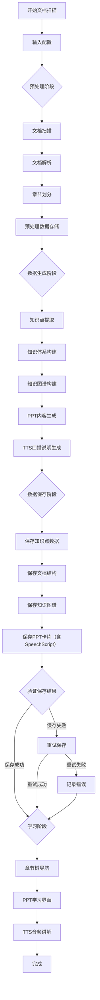
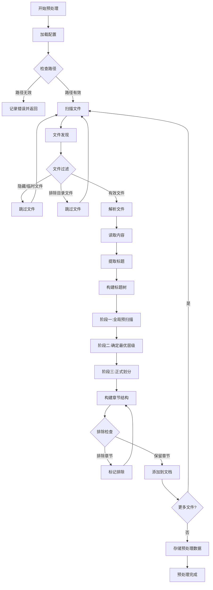
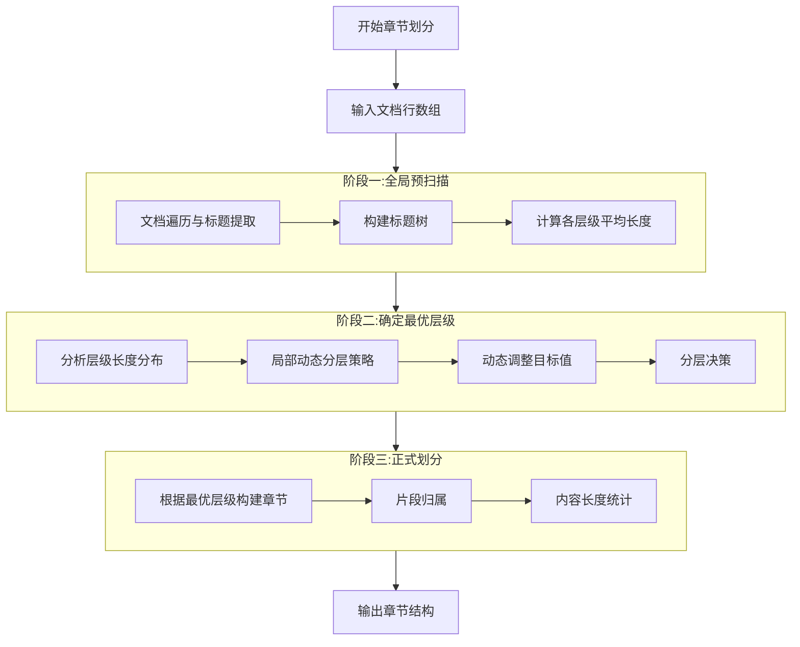
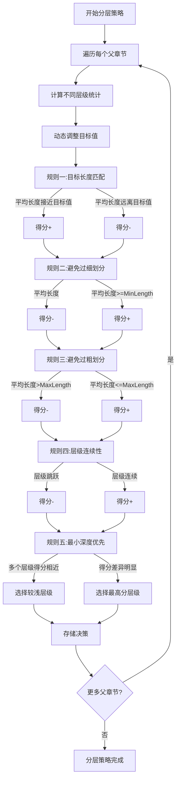
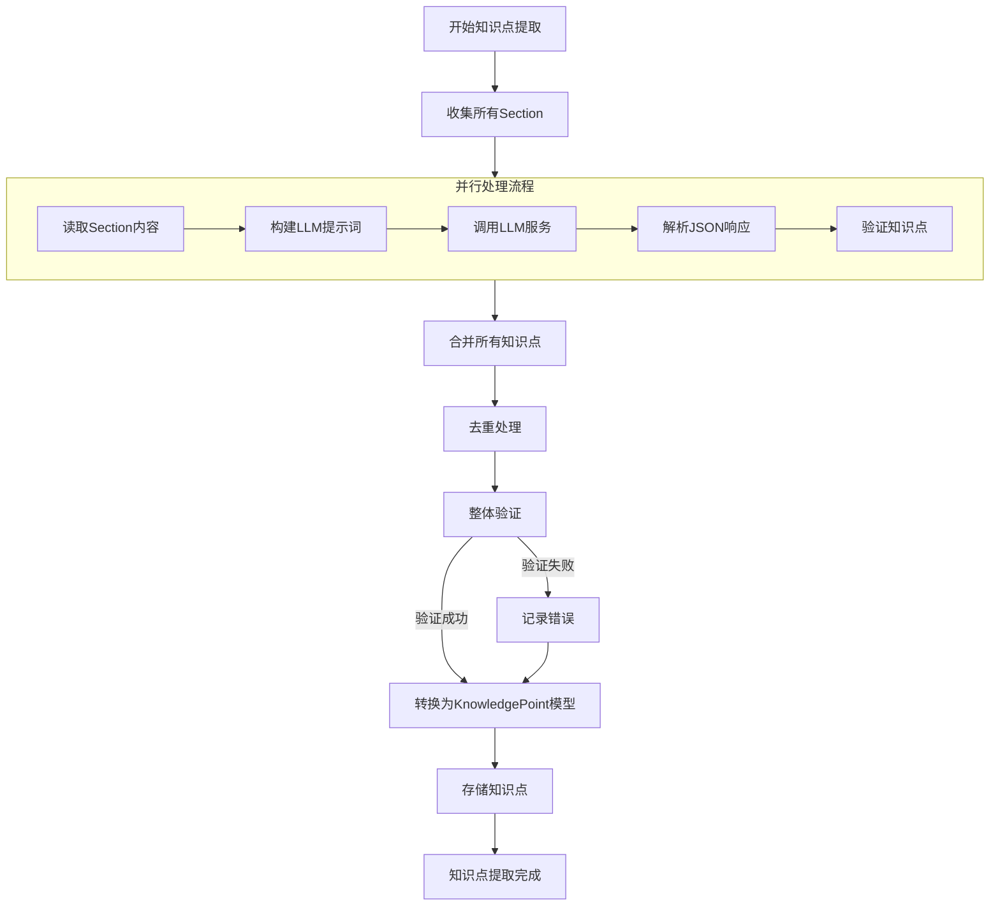
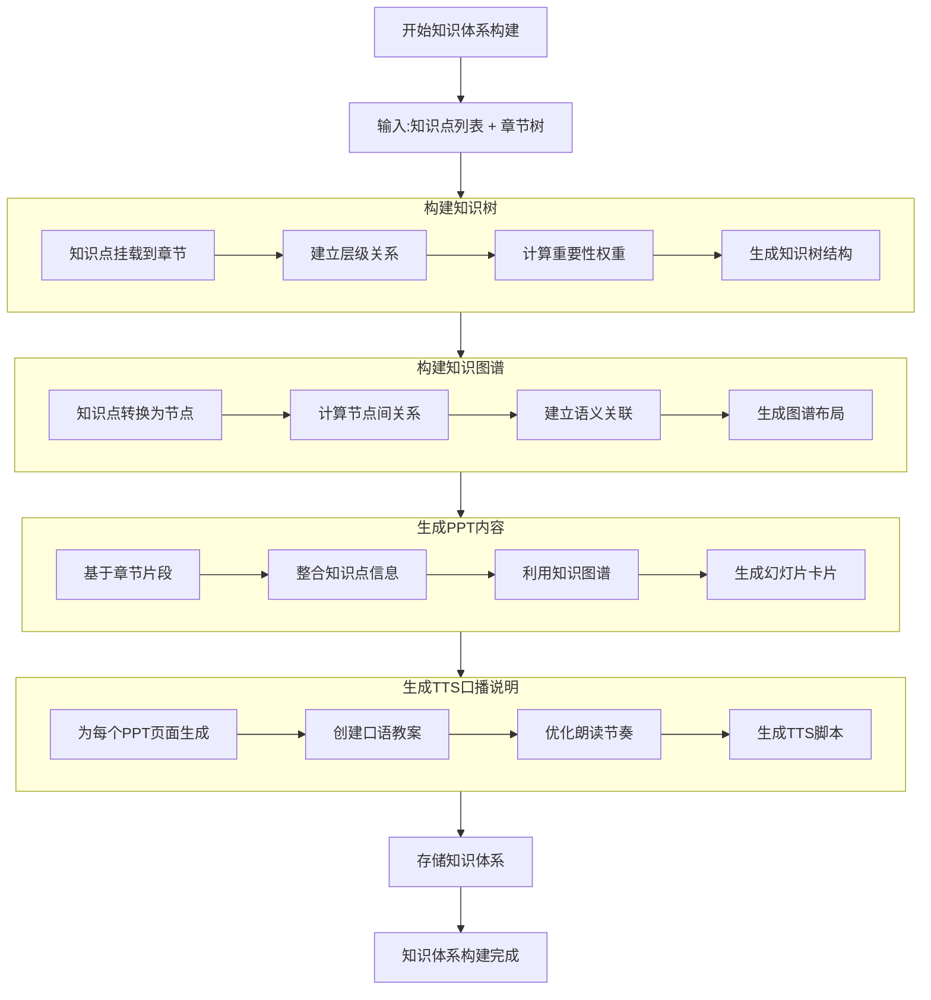
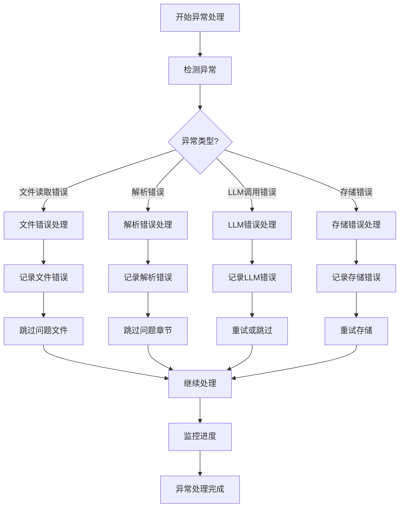
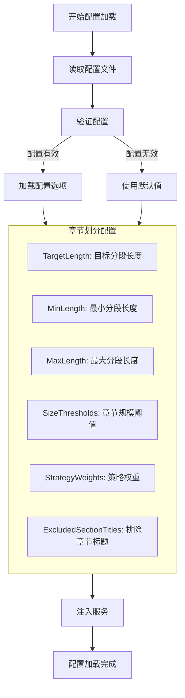
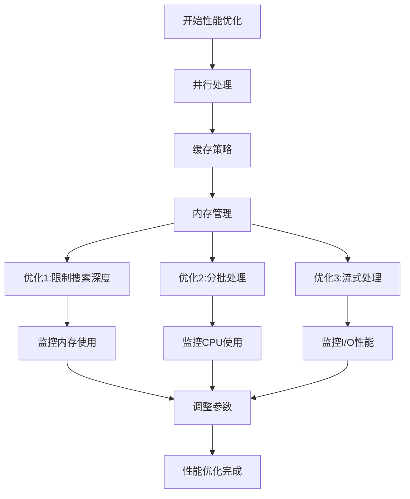
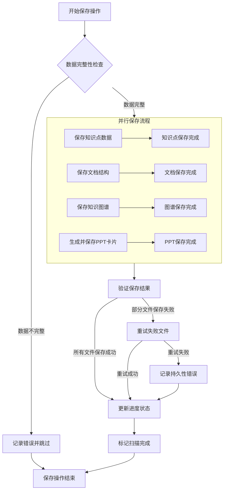

# 文档扫描处理流程 - 流程图文档

## 1. 整体架构概览

```
┌─────────────────────────────────────────────────────────────────────────────┐
│                             文档扫描与知识体系构建系统                         │
├─────────────────────────────────────────────────────────────────────────────┤
│                                                                             │
│  ┌─────────────┐    ┌─────────────┐    ┌─────────────┐    ┌─────────────┐  │
│  │  预处理阶段  │    │ 数据生成阶段 │    │  学习阶段   │    │  存储阶段   │  │
│  │             │    │             │    │             │    │             │  │
│  │ • 文档扫描   │    │ • 知识点提取 │    │ • 章节导航  │    │ • 文件存储  │  │
│  │ • 章节划分   │    │ • 知识体系   │    │ • PPT学习  │    │ • 数据库    │  │
│  │ • 片段切分   │    │ • 知识图谱   │    │ • TTS口播  │    │ • 缓存      │  │
│  │ • 数据存储   │    │ • PPT生成   │    │             │    │             │  │
│  └──────┬──────┘    └──────┬──────┘    └──────┬──────┘    └──────┬──────┘  │
│         │                  │                   │                   │        │
│         └──────────────────┼───────────────────┼───────────────────┘        │
│                            │                   │                            │
│  ┌─────────────────────────▼───────────────────▼──────────────────────────┐  │
│  │                        统一的数据模型与接口                              │  │
│  │                                                                        │  │
│  │  Document ──┬── Section ──┬── KnowledgePoint ──┬── KnowledgeSystem     │  │
│  │             │             │                     │                       │  │
│  │  SlideCard  │  KnowledgeGraph │  TTSScript     │  ChapterTree          │  │
│  └────────────────────────────────────────────────────────────────────────┘  │
└─────────────────────────────────────────────────────────────────────────────┘
```

## 2. 核心处理流程总览



## 3. 详细处理流程

### 3.1 预处理阶段流程



### 3.2 章节划分算法流程（局部动态分层策略）



### 3.3 局部动态分层策略详细流程



### 3.4 知识点提取流程



### 3.5 知识体系构建流程



## 4. 数据流图

### 4.1 数据转换流程

```
原始文档 (Markdown)
     │
     ▼
Document 对象
     │
     ▼
Section 列表 (章节树)
     │
     ▼
KnowledgePoint 列表
     │
     ▼
KnowledgeSystem (知识体系)
     │
     ▼
KnowledgeGraph (知识图谱)
     │
     ▼
SlideCard 列表 (PPT内容)
     │
     ▼
TTSScript 列表 (口播说明)
```

### 4.2 数据存储流程

```
预处理数据 ────┐
               │
知识点数据 ─────┤
               ├──▶ 文件存储 (JSON格式)
知识体系数据 ───┤
               │
PPT内容 ───────┤
               │
TTS脚本 ───────┘
     │
     ▼
SQLite数据库 ───┐
               ├──▶ 持久化存储
缓存数据 ───────┘
```

## 5. 异常处理流程



## 6. 配置参数流程图



## 7. 性能优化流程图



## 8. 核心算法复杂度分析

### 8.1 时间复杂度

```
文档扫描: O(n) - n为文件数量
章节划分: O(m) - m为文档行数
知识点提取: O(p) - p为Section数量（并行处理）
知识图谱构建: O(k²) - k为知识点数量
```

### 8.2 空间复杂度

```
文档解析: O(m) - m为文档内容大小
章节树: O(s) - s为章节数量
知识点存储: O(k) - k为知识点数量
知识图谱: O(k + e) - k为节点数，e为边数
```

## 9. 关键决策点

### 9.1 章节划分决策矩阵

| 条件 | 决策 | 理由 |
|------|------|------|
| 平均长度接近目标值 | 选择该层级 | 最优匹配 |
| 平均长度 < MinLength | 跳过该层级 | 避免过细划分 |
| 平均长度 > MaxLength | 继续寻找更细层级 | 避免过粗划分 |
| 多个层级得分相近 | 选择较浅层级 | 最小深度优先 |
| 层级跳跃 | 降低得分 | 保持层级连续性 |

### 9.2 异常处理决策矩阵

| 异常类型 | 处理策略 | 恢复机制 |
|----------|----------|----------|
| 文件读取失败 | 跳过文件 | 记录日志，继续处理其他文件 |
| 解析错误 | 跳过章节 | 使用默认解析，记录错误 |
| LLM调用失败 | 重试3次 | 指数退避重试，最后跳过 |
| 存储失败 | 重试存储 | 检查存储空间，重试机制 |

## 10. 验证检查点

### 10.1 预处理阶段验证

- [ ] 所有Markdown文件已扫描
- [ ] 排除目录已正确过滤
- [ ] 章节树结构完整
- [ ] 内容长度统计准确
- [ ] 排除章节已正确标记

### 10.2 数据生成阶段验证

- [ ] 知识点提取完整
- [ ] 知识点类型有效
- [ ] 重要性权重合理
- [ ] 知识图谱关系正确
- [ ] PPT内容生成完整
- [ ] TTS脚本可读性强

### 10.3 学习阶段验证

- [ ] 章节树导航正常
- [ ] PPT显示正确
- [ ] TTS音频可播放
- [ ] 知识图谱可视化正常

## 11. 扫描完成后的文件保存操作

### 11.1 整体存储结构

文档扫描完成后，系统会按照以下目录结构保存数据：

```
saves/
  ├── {BookHubId}/                    # 书籍中心ID命名的目录
  │   ├── knowledge-points.json       # 知识点数据文件
  │   ├── documents.json              # 文档章节结构文件
  │   ├── knowledge-graph.json        # 知识图谱文件
  │   └── slide-cards/                # 幻灯片卡片目录
  │       ├── kp_{KpId}.json          # 单个知识点PPT卡片（包含SpeechScript）
  │       └── ...
```

### 11.2 文件保存流程图



### 11.3 保存文件类型和内容

#### 11.3.1 知识点数据文件
**文件名**: `knowledge-points.json`  
**存储服务**: [KnowledgeSystemStore.cs](../../src/ASimpleTutor.Core/Services/KnowledgeSystemStore.cs)  
**内容类**: `KnowledgePointsSaveModel`  
**关联模型**: [KnowledgePoint.cs](../../src/ASimpleTutor.Core/Models/KnowledgePoint.cs)

#### 11.3.2 文档章节结构文件
**文件名**: `documents.json`  
**存储服务**: [KnowledgeSystemStore.cs](../../src/ASimpleTutor.Core/Services/KnowledgeSystemStore.cs)  
**内容类**: `List<Document>`  
**关联模型**: [Document.cs](../../src/ASimpleTutor.Core/Models/Document.cs)

#### 11.3.3 知识图谱文件
**文件名**: `knowledge-graph.json`  
**存储服务**: [KnowledgeGraphStore.cs](../../src/ASimpleTutor.Core/Services/KnowledgeGraphStore.cs)  
**内容类**: `KnowledgeGraph`  
**关联模型**: [KnowledgeGraph.cs](../../src/ASimpleTutor.Core/Models/KnowledgeGraph.cs)

#### 11.3.4 幻灯片卡片文件
**目录名**: `slide-cards/`  
**文件名格式**: `kp_{KpId}.json`  
**内容类**: `SlideCard`  
**关联模型**: [SlideCard](../../src/ASimpleTutor.Core/Models/KnowledgePoint.cs#L122-L164) (在KnowledgePoint.cs中定义)

#### 11.3.5 TTS口播说明（内嵌在SlideCard中）
**属性名**: `SpeechScript`  
**位置**: 内嵌在`SlideCard`模型的`SpeechScript`属性中  
**内容类**: `string` (口语化讲解脚本)  
**关联模型**: [SlideCard](../../src/ASimpleTutor.Core/Models/KnowledgePoint.cs#L122-L164) 中的 `SpeechScript` 属性

### 11.4 数据关联关系

```
Document (文档)
  ├── Section (章节)
  │     └── KnowledgePoint (知识点)
  │           ├── KnowledgeGraphNode (知识图谱节点)
  │           └── SlideCard (幻灯片卡片，包含SpeechScript属性)
  └── KnowledgeSystem (知识体系)
        └── KnowledgeGraph (知识图谱)
```

### 11.5 存储服务类说明

| 存储服务类 | 文件路径 | 主要功能 |
|------------|----------|----------|
| `KnowledgeSystemStore` | [KnowledgeSystemStore.cs](../../src/ASimpleTutor.Core/Services/KnowledgeSystemStore.cs) | 保存和加载知识系统数据 |
| `KnowledgeGraphStore` | [KnowledgeGraphStore.cs](../../src/ASimpleTutor.Core/Services/KnowledgeGraphStore.cs) | 保存和加载知识图谱数据 |
| `LearningProgressStore` | [LearningProgressStore.cs](../../src/ASimpleTutor.Core/Services/LearningProgressStore.cs) | 保存和加载学习进度 |
| `MistakeNotebookStore` | [MistakeNotebookStore.cs](../../src/ASimpleTutor.Core/Services/MistakeNotebookStore.cs) | 保存和加载错题记录 |

### 11.6 数据持久化流程

#### 11.6.1 保存流程
```
1. 扫描完成 → 生成Document和Section对象
2. 知识点提取 → 生成KnowledgePoint对象
3. 知识体系构建 → 生成KnowledgeSystem对象
4. 知识图谱构建 → 生成KnowledgeGraph对象
5. PPT生成 → 生成SlideCard对象（包含SpeechScript属性）
6. 并行保存到文件系统
```

#### 11.6.2 加载流程
```
1. 检查存储目录是否存在
2. 并行加载知识点和文档数据
3. 重建知识树结构
4. 加载知识图谱数据
5. 加载学习进度数据
6. 返回完整的知识系统
```

### 11.7 关键数据模型类清单

| 类名 | 文件路径 | 描述 |
|------|----------|------|
| `Document` | [Document.cs](../../src/ASimpleTutor.Core/Models/Document.cs) | 文档模型 |
| `Section` | [Section.cs](../../src/ASimpleTutor.Core/Models/Section.cs) | 章节模型 |
| `KnowledgePoint` | [KnowledgePoint.cs](../../src/ASimpleTutor.Core/Models/KnowledgePoint.cs) | 知识点模型 |
| `KnowledgeSystem` | [KnowledgeSystem.cs](../../src/ASimpleTutor.Core/Models/KnowledgeSystem.cs) | 知识体系模型 |
| `KnowledgeGraph` | [KnowledgeGraph.cs](../../src/ASimpleTutor.Core/Models/KnowledgeGraph.cs) | 知识图谱模型 |
| `SlideCard` | [KnowledgePoint.cs#L122-L164](../../src/ASimpleTutor.Core/Models/KnowledgePoint.cs#L122-L164) | 幻灯片卡片模型（包含SpeechScript属性） |

### 11.8 设计文档参考

- [05-数据模型与存储策略.md](../05-数据模型与存储策略.md) - 存储策略设计
- [01-文档扫描与知识体系构建.md](../01-文档扫描与知识体系构建.md) - 整体架构设计

---

## 附录：流程图符号说明

```
矩形: 处理步骤
菱形: 决策点
平行四边形: 输入/输出
圆形: 开始/结束
双矩形: 子流程
虚线框: 并行处理
箭头: 数据流/控制流
```

## 附录：关键配置参数

| 参数 | 默认值 | 说明 |
|------|--------|------|
| TargetLength | 3000 | 目标分段长度（字符） |
| MinLength | 500 | 最小分段长度（字符） |
| MaxLength | 10000 | 最大分段长度（字符） |
| SmallThreshold | 5000 | 小章节阈值（字符） |
| MediumThreshold | 20000 | 中等章节阈值（字符） |

---

*文档创建日期: 2026-02-21*
*最后更新日期: 2026-02-21*
*版本: 1.1*